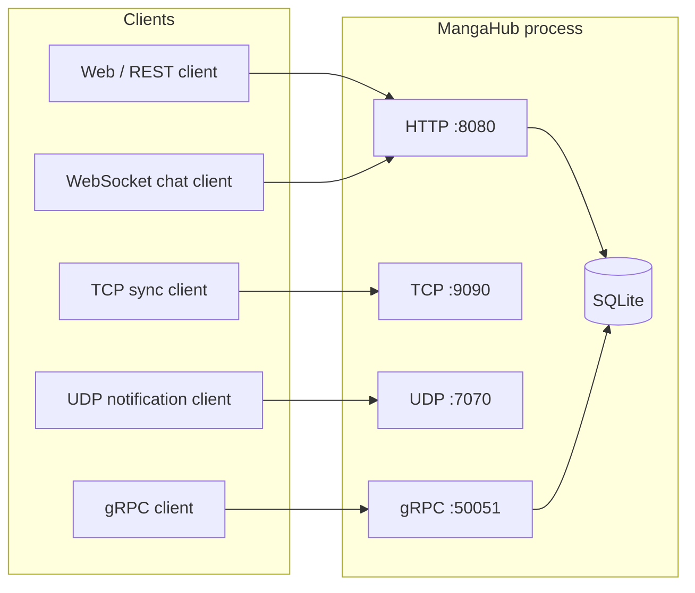
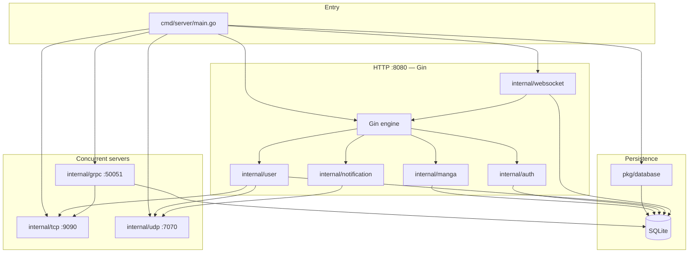
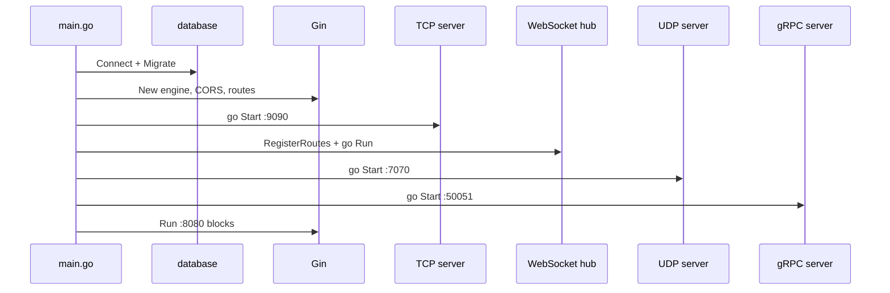
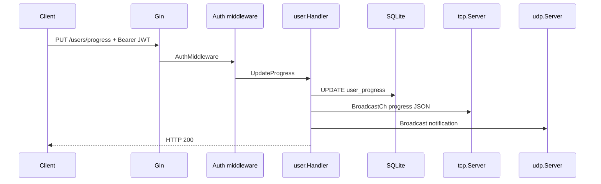
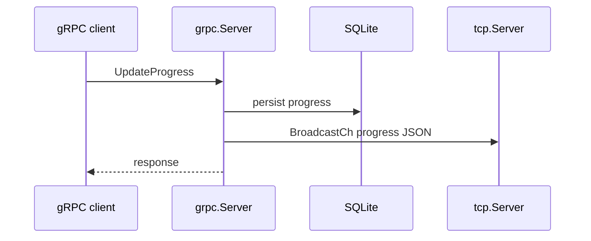
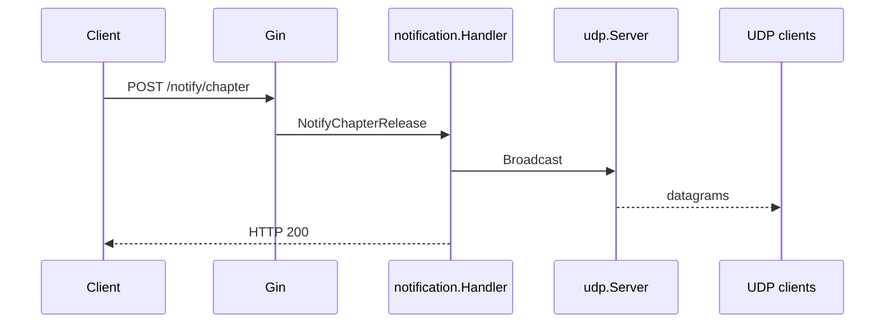
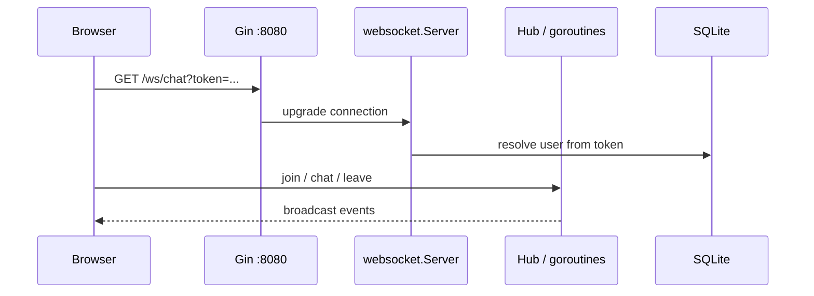
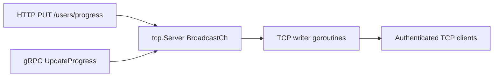

# MangaHub — Architecture Flow

This document describes how the MangaHub net-centric backend is structured at runtime and how traffic moves between protocols, handlers, and storage.

## 1. System context

One **Go process** hosts multiple listeners. Clients may use HTTP (REST + WebSocket), TCP, UDP, or gRPC depending on the feature. All business data that survives restarts goes through **SQLite** (`mangahub.db` by default).

## 2. Internal components

Handlers under `internal/` are wired in `cmd/server/main.go`. Shared dependencies are the database handle and, where needed, the TCP and UDP server instances for fan-out after progress or notification events.

## 3. Startup sequence

At boot, the process prepares storage first, then starts protocol servers so they are ready before or while HTTP routes are registered.

## 4. Typical data flows

### 4.1 REST: authenticated user updates reading progress

`PUT /users/progress` persists to SQLite, then notifies real-time channels.

### 4.2 gRPC: `UpdateProgress`

The gRPC service updates the database and pushes to the same TCP sync channel (no UDP path in this RPC unless extended elsewhere).

### 4.3 HTTP: chapter release notification (UDP fan-out)

`POST /notify/chapter` does not require the full user progress pipeline; it broadcasts to registered UDP listeners.

### 4.4 WebSocket chat

The WebSocket server shares the Gin router; clients authenticate with a JWT (for example via query string as documented in the README). Messages are relayed between connected users through the in-memory hub while user identity is resolved using the database.

### 4.5 TCP progress sync (outbound from server)

TCP clients connect to `:9090`, authenticate with JWT, and receive JSON pushed when their user’s progress is updated over REST or gRPC.

## 5. Protocol summary

| Listener | Package | Primary responsibility |
|----------|---------|-------------------------|
| `:8080` | Gin + `internal/*` routes + `internal/websocket` | REST API, health, chat upgrade |
| `:9090` | `internal/tcp` | Push reading progress to connected TCP clients |
| `:7070` | `internal/udp` | Lightweight broadcast notifications |
| `:50051` | `internal/grpc` | Manga lookup, search, progress RPCs |

## 6. Source layout (reference)

| Path | Role |
|------|------|
| `cmd/server/main.go` | Composition root: DB, Gin, TCP, UDP, gRPC, WebSocket |
| `internal/auth` | JWT issuance and middleware |
| `internal/manga` | Manga REST + seed from `data/manga.json` |
| `internal/user` | Library + progress; bridges to TCP and UDP |
| `internal/notification` | HTTP trigger → UDP broadcast |
| `internal/tcp` | Progress sync server |
| `internal/udp` | Notification server |
| `internal/websocket` | Real-time chat |
| `internal/grpc` | `MangaService` implementation |
| `pkg/database` | SQLite connection and migrations |
| `proto/` | Contract and generated stubs |

---

For endpoint-level detail, see [api.md](./api.md). For a scripted walkthrough, see [demo.md](./demo.md).
